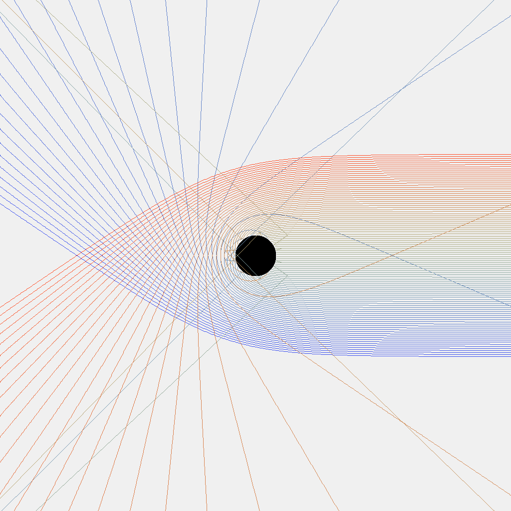
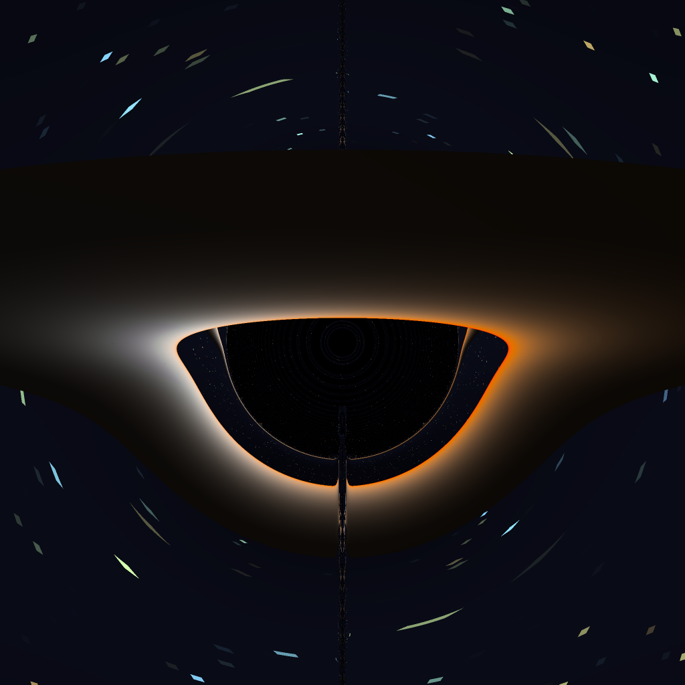
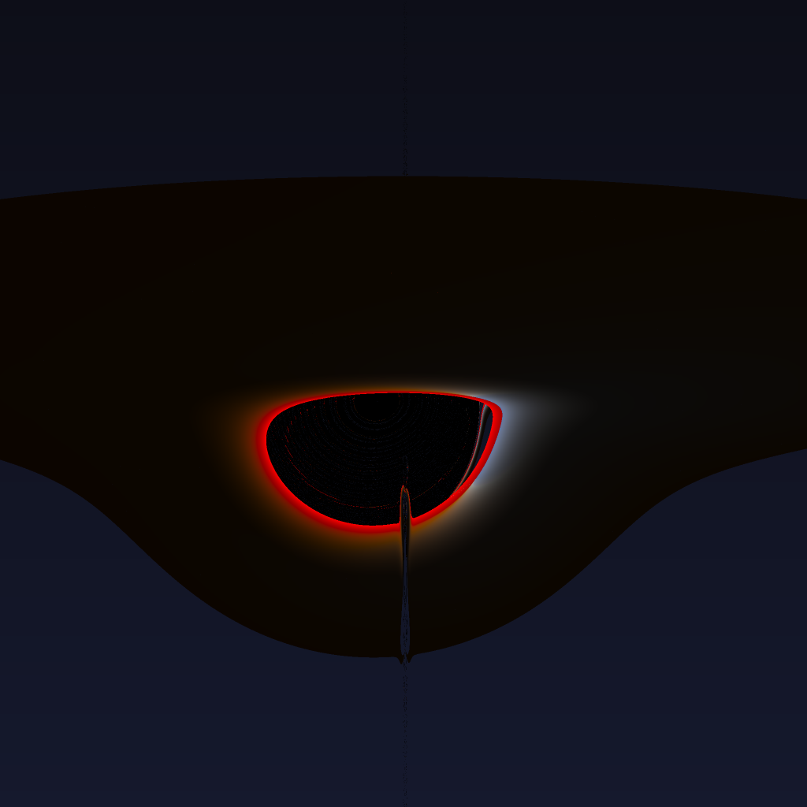
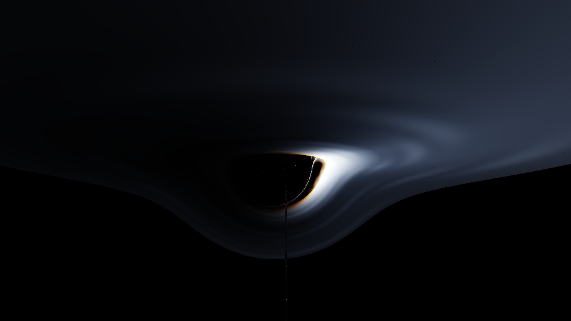

# Singularity

[](https://github.com/mal0ware/Singularity/actions/workflows/ci.yml)
[](https://codecov.io/gh/mal0ware/Singularity)
[](LICENSE)

**[Try the live demo in your browser](https://mal0ware.github.io/Singularity/)** — the WebGPU build runs on the project site, no install required.

## Status

- **v1.0.0 shipped** (April 2026): Metal, Vulkan, and WebGPU real-time backends, CUDA offline path, live web demo, docs site.
- **v1.1** (video export and related milestones): not yet started.
- **Vulkan backend**: compile-validated in CI and runtime-smoked on Windows (RTX 3080, offscreen single-frame `--capture` renders, Schwarzschild and Kerr). Interactive validation and the Metal-equivalence perceptual-hash check are still pending.

A real-time, physically accurate black-hole renderer. Each pixel of each frame integrates a null geodesic backwards through curved spacetime: a photon launched from the camera, traced through the Schwarzschild or Kerr metric, until it falls through the event horizon, intersects the accretion disc, or escapes to the celestial sphere. The full geodesic equation runs in the compute kernel. No precomputed lensing tables, no screen-space approximations.

Four GPU backends share a single C++ physics core: Metal on macOS, Vulkan on Windows and Linux, WebGPU in the browser, CUDA for offline supersampled stills.


## Features

- Schwarzschild and Kerr metrics, with spin `a/M` settable from `0` (Schwarzschild) up to `0.998` (near-extremal).
- Novikov-Thorne thin accretion disc with Tanner-Helland blackbody-to-sRGB color, ISCO-aware inner edge, and procedural turbulence bands.
- Relativistic Doppler beaming (`I_obs = g⁴ · I_emit`) and gravitational redshift as toggleable disc effects.
- HDR pipeline: half-float intermediate target, bloom (extract + separable Gaussian), ACES tone-mapping, sRGB output.
- Orbital camera with mouse-drag azimuth/elevation, scroll-zoom, slider-based FOV.
- In-app settings panel exposing the metric, disc geometry, cinematics, and physics toggles. Dear ImGui on desktop; DOM overlay on web.
- Offline supersampling on the CUDA path: 1 to 1024 samples per pixel via Halton(2,3) jittered subpixel sampling, with per-sample tone-mapping for filmic averaging.
- Verified physics. SymPy-derived Christoffel cross-checks, photon sphere and ISCO closed-form agreement, conservation of energy and angular momentum and Carter's constant under integration.

## Backends

| Backend | Status | Platform | Notes |
|---|---|---|---|
| Metal | Live | macOS (Apple Silicon) | Native compute and cinematic pipeline; ad-hoc signed `.app`. |
| Vulkan | Code-complete | Windows, Linux | Vulkan-Hpp; CI-built `.msi` artefact via CPack/WiX. |
| WebGPU | Live | Browser (Chrome 113+, Safari 17.4+, Edge 113+) | Emscripten + Dawn (`emdawnwebgpu` port); ~80 KB wasm + WGSL bundle. |
| CUDA | Live | NVIDIA GPUs (sm_80+) | Offline-only; 4K Kerr at 256 SPP renders in about 2:42 on Ampere. |

The WebGPU backend is embedded as a live demo on the [project site](https://mal0ware.github.io/Singularity/).

## Quick start

```bash
git clone --recurse-submodules https://github.com/mal0ware/Singularity.git
cd Singularity

# CMake auto-selects the platform-native backend.
#   macOS   -> Metal   (requires Xcode for the metal shader compiler)
#   Windows -> Vulkan  (requires the LunarG SDK for dxc)
#   Linux   -> Vulkan  (libvulkan-dev + dxc, or the vendored headers)
cmake -B build -DCMAKE_BUILD_TYPE=Release
cmake --build build --config Release

# Run.
open build/app/singularity.app               # macOS
.\build\app\Release\singularity.exe          # Windows
./build/app/singularity                      # Linux
```

Pre-built installers ship on the [Releases](https://github.com/mal0ware/Singularity/releases) page. Per-platform setup notes (Xcode + `codesign` + notarization on macOS; LunarG SDK + WiX + the SmartScreen workaround on Windows) live in [`docs/NEXT_STEPS_MAC.md`](docs/NEXT_STEPS_MAC.md) and [`docs/NEXT_STEPS_WINDOWS.md`](docs/NEXT_STEPS_WINDOWS.md).

## Technology stack

| Layer | Choice | Rationale |
|---|---|---|
| Language | C++20 | First-class binding for all four GPU APIs (`metal-cpp`, `Vulkan-Hpp`, CUDA C++, Emscripten `webgpu_cpp.h`). |
| Build system | CMake 3.27+ | Single graph spans desktop, web, and CUDA targets gated by `SINGULARITY_BACKEND_*` and `SINGULARITY_BUILD_WEB` options. |
| Windowing | SDL3 | Cross-platform window, input, and Vulkan-surface creation. |
| In-app UI | Dear ImGui | Metal, Vulkan, and SDL3 backends; the web demo uses a DOM overlay instead. |
| Math validation | SymPy + SciPy | Re-derives the Christoffel symbols and analytic geodesic invariants from scratch. |
| Image utilities | `stb_image_write` | Header-only PNG output for the CLI and screenshot paths. |
| Tests | Catch2 v3 + pytest | C++ unit tests plus a Python golden-image and equivalence harness. |
| CI | GitHub Actions | Lint, ASan/UBSan, gcov coverage, build-test (4 OS/backend pairs), build-app (`.app` + `.exe` + `.msi`), build-web (wasm bundle + headless smoke). |
| Web bundling | Emscripten + `--use-port=emdawnwebgpu` | Dawn standards-track WebGPU surface; preloads WGSL via `--preload-file`. |
| Docs site | Jekyll on GitHub Pages | Hand-rolled layout, KaTeX from CDN. |

The defining design choice is that the physics lives in `shared_shader/` as a set of header-only C++ files: Schwarzschild and Kerr metric tensors, Christoffel symbols, the Hamiltonian formulation in canonical momenta, the integrators, the Novikov-Thorne disc model, the Doppler and redshift factors. These headers compile unchanged into MSL, HLSL, and CUDA C++. WGSL has no preprocessor, so the WGSL kernels are hand-translated against the same algorithms; the cheatsheet is in [`docs/PHASE7_WEBGPU.md`](docs/PHASE7_WEBGPU.md). Every backend therefore consumes the same source-of-truth physics. A bug fix in one place fixes it everywhere, and CI's backend-equivalence test enforces that rendered output agrees within perceptual-hash tolerance across backends.

## Physics

The renderer integrates the geodesic equation in two regimes.

**Schwarzschild (`a = 0`)** is the spherically symmetric solution to the vacuum Einstein equations for a non-rotating mass `M`. The implementation uses the standard `(t, r, θ, φ)` coordinate Christoffels with a 4th-order Runge-Kutta integrator stepping in affine parameter.

**Kerr (`a > 0`)** is the rotating black hole solution. It is integrated in the Hamiltonian formulation with conserved-quantity coordinates `(E, L_z, Q)` rather than raw Christoffels. This formulation is numerically better-conditioned at high spin and avoids singularities in the Boyer-Lindquist `Δ → 0` limit.

The accretion disc uses the Novikov-Thorne thin-disc temperature profile `T(r) ∝ r^(-3/4)`, mapped to spectral radiance via Wien's displacement and a Tanner-Helland blackbody-to-sRGB color table. Disc emission is multiplied by `g⁴` (Doppler beaming) and `√((1 - r_s/r_obs) / (1 - r_s/r_emit))` (gravitational redshift) when those toggles are on.

The verification harness in `verification/` enforces the physics:

- Schwarzschild Christoffel symbols are re-derived in SymPy from scratch and asserted equal to the hand-coded constants.
- Photon sphere closure at `r = 1.5 r_s` is checked to 0.5% over 40 impact parameters.
- Weak-field deflection matches Eddington's `4GM/(bc²)` to 1% over 12 impact parameters.
- Kerr ISCO radii (prograde and retrograde) match closed-form expressions to 0.1% for `a/M ∈ {0, 0.5, 0.94, 0.998}`.
- Energy `E`, axial angular momentum `L_z`, and Carter's constant `𝒬` are conserved to residual `< 10⁻⁶` over 10,000 integrator steps.

The full reference is in [`docs/PHYSICS.md`](docs/PHYSICS.md). Methods, sources, and per-section citations to MTW, Carroll, Thorne, and the James/Tunzelmann/Franklin/Thorne 2015 *Interstellar* VFX paper appear inline.

## CLI

A headless `singularity_cli` ships alongside the GUI app and runs everywhere, including platforms without a GPU.

| Mode | Description |
|---|---|
| `2d-toy` | Schwarzschild equatorial ray fan; PNG + CSV output. |
| `kerr-2d-toy` | Kerr equatorial ray fan illustrating frame-dragging. |
| `kerr-geometry` | Kerr analytic scalars (horizons, ISCO, photon spheres, ergosphere) as JSON. |
| `photon-orbit` | Closed circular photon orbit, Schwarzschild or Kerr prograde. |
| `disc-preview` | Top-down Novikov-Thorne disc render via the blackbody LUT. |
| `cpu-render` | Per-pixel multithreaded Schwarzschild ray-trace; 1024² in roughly 6 s on 32 threads. |
| `kerr-cpu-render` | Kerr counterpart using the Hamiltonian integrator. |
| `benchmark` | Deterministic-step integrator microbench (JSON output for CI regression tracking). |

Scene presets live in text files (`--scene docs/examples/kerr_near_extremal.conf`).

## Hardware support

| Hardware | Expected performance |
|---|---|
| Apple M1 / M2 | 30 FPS @ 1280×720 Schwarzschild, 15 FPS Kerr |
| Apple M2 Pro / M3 / M4 | 60 FPS @ 1280×720 Schwarzschild, 30 FPS Kerr |
| Apple M3 Pro+ / M4 Pro+ | 60 FPS @ 1920×1080 Schwarzschild, 45 FPS Kerr |
| GTX 1060 / RTX 2060 | 45 FPS @ 1280×720, either metric |
| RTX 3070 / 4060+ | 60 FPS @ 1920×1080, either metric |
| RTX 3090 / 4080+ | 120 FPS @ 1920×1080, headroom for 4K |
| Integrated / pre-2018 | Functional at 640×360 |

The CUDA offline path scales to 4K and 8K. A 4K Kerr `a/M = 0.94` still renders in about 2:42 on an RTX 3090 at 256 SPP. 8K runs in roughly six minutes.

## Roadmap

v1.0 (shipped): three real-time GPU backends, CUDA offline path, embedded WebGPU demo with interactive controls, public documentation site.

v1.1 (in progress):

- 30-second 4K Kerr camera-orbit video via the CUDA backend's sequential-frame mode and an ffmpeg encoder.
- Async `capture_frame` body-fill on web (`wgpuBufferMapAsync` plus `ccall` cache).
- Lighthouse 95+ audit on the docs site.
- Video export from the desktop apps (AVFoundation on macOS, Media Foundation on Windows).
- Strict Metal vs. Vulkan perceptual-hash equivalence test (currently CPU vs. GPU only).
- Apple Developer Program enrollment and Mac notarization.
- Windows runtime smoke on a real Vulkan GPU.

v1.2+ backlog:

- Wormhole metric (Morris-Thorne) as a third metric option.
- Linux `.AppImage` release.
- Binary black hole far-field superposition.
- Real Sgr A* mode (real ephemeris, real mass, best-estimate spin).
- Adaptive mesh refinement near caustics.
- Educational tour mode with precomputed camera paths.

The exhaustive checkbox-level plan is in [`docs/TODO.md`](docs/TODO.md).

## Documentation

| File | Subject |
|---|---|
| [`docs/PRD.md`](docs/PRD.md) | Vision, scope, requirements, tech-stack rationale, milestones, risks. |
| [`docs/PHYSICS.md`](docs/PHYSICS.md) | General relativity reference: metrics, Christoffels, geodesics, Kerr, Carter, disc thermodynamics, validation strategy. |
| [`docs/ARCHITECTURE.md`](docs/ARCHITECTURE.md) | Engineering reference: backend abstraction, the four GPU pipelines, shader sharing, build system, CI/CD, distribution, testing. |
| [`docs/TODO.md`](docs/TODO.md) | Exhaustive phased task list with commit-SHA-tagged checkboxes. |
| [`docs/PHASE7_WEBGPU.md`](docs/PHASE7_WEBGPU.md) | WebGPU + WASM design notes and HLSL to WGSL translation cheatsheet. |
| [`docs/PHASE8_CUDA.md`](docs/PHASE8_CUDA.md) | CUDA offline backend implementation notes. |
| [`docs/NEXT_STEPS_MAC.md`](docs/NEXT_STEPS_MAC.md) | macOS bring-up: Xcode, codesign, notarization, `.dmg` packaging. |
| [`docs/NEXT_STEPS_WINDOWS.md`](docs/NEXT_STEPS_WINDOWS.md) | Windows bring-up: LunarG SDK, WiX, SmartScreen, signing posture. |

The [project site](https://mal0ware.github.io/Singularity/) renders the curated subset (landing, physics, architecture, about, download) with KaTeX-rendered math and the embedded WebGPU demo.

## Earlier renders

Historical 2D and CPU output, kept here as design milestones and as a sanity check for the GPU pipelines.



*Phase 1: 100 null geodesics in 2D Schwarzschild, CPU integrator only.*


*Kerr equatorial ray fan at `a/M = 0.9`. Warm rays travel prograde with the spin; cool rays travel retrograde against it. The asymmetry in their bending is frame-dragging.*



*CPU ray-traced Schwarzschild with disc; 1024² at 2× supersampling, ~6 s on 32 threads. The bright halo above the shadow is the back of the disc, lensed up and over the top by the Schwarzschild geometry.*



*CPU Kerr at `a/M = 0.9` via the Hamiltonian integrator. Asymmetric photon ring; Doppler-bright approaching side; gravitationally redshifted receding side.*



*WebGPU demo in headless Chromium (SwiftShader Vulkan). Same Hamiltonian integrator and HDR/bloom/ACES pipeline as the desktop backends, compiled to wasm.*

## Citation

```bibtex
@software{singularity_2026,
  author  = {{mal0ware}},
  title   = {Singularity: a real-time physically-accurate black hole renderer},
  year    = {2026},
  version = {1.0.0},
  url     = {https://github.com/mal0ware/Singularity},
  note    = {Cross-platform Schwarzschild and Kerr geodesic ray-tracer with
             Metal, Vulkan, WebGPU, and CUDA backends sharing one C++ physics
             core}
}
```

For the underlying GR and lensing math, cite the source the implementation derives from: James, Tunzelmann, Franklin, & Thorne, *Class. Quantum Grav.* **32** (2015) 065001 (the *Interstellar* VFX paper). Together with the textbooks listed in [`docs/PHYSICS.md`](docs/PHYSICS.md).

## License

Code (including shaders): [MIT](LICENSE).
Documentation and rendered images: [CC-BY-SA 4.0](https://creativecommons.org/licenses/by-sa/4.0/).
See [`LICENSE`](LICENSE) for the code license and [`LICENSE-docs.md`](LICENSE-docs.md) for the documentation and media licensing terms.

## Acknowledgments

Source material that defined the project's scope:

- Kavan Dave, *I Coded a Black Hole Simulator in C++*. Defined the MVP scope for Phases 1 through 3.
- ScienceClic, *Could the physics in Interstellar be real?*. Drove the Kerr / Doppler / Carter direction.

Physics references in `docs/PHYSICS.md` cite Misner, Thorne, & Wheeler's *Gravitation*; Sean Carroll's *Spacetime and Geometry*; and Kip Thorne's *The Science of Interstellar*. The Kerr lensing implementation follows James, Tunzelmann, Franklin, & Thorne (2015).
